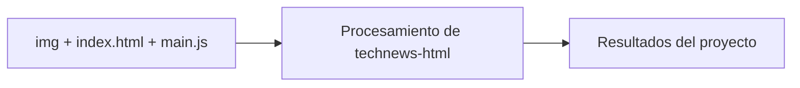

# Tech News HTML

## Descripción

Interfaz web estática de noticias tecnológicas construida con HTML, CSS y JavaScript. Incluye recursos visuales y una composición responsive orientada a presentar artículos de actualidad.

## Diagrama

[Explorar la arquitectura interactiva en GitDiagram](https://gitdiagram.com/HoracioLaphitz/technews-html)

## Tecnologías

- HTML
- CSS
- JavaScript
