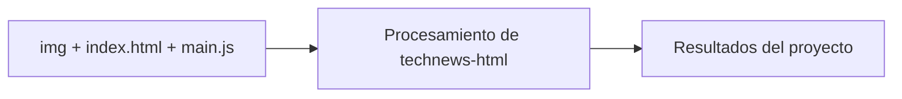

# Tech News HTML

## Descripción

# Recomendations
* Minimize the size of Images
* put a favicon

# Resources
* [Pexels.com](https://www.pexels.com/)
* [HeroPatterns.com](https://www.heropatterns.com/). Death Start is choosen in this project

## Diagrama

[Explorar la arquitectura interactiva en GitDiagram](https://gitdiagram.com/HoracioLaphitz/technews-html)

## Tecnologías

- HTML
- CSS
- JavaScript
